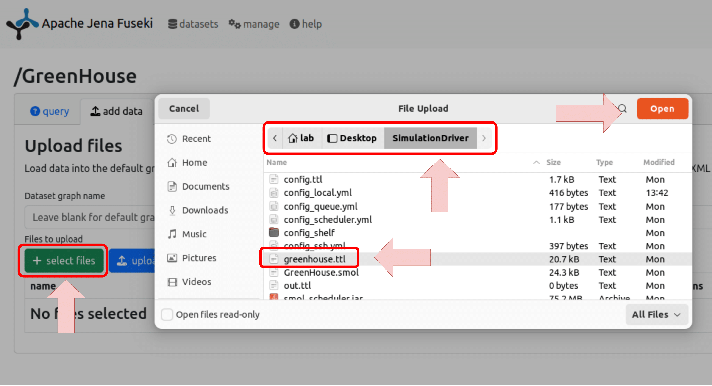

# GreenHouseDT

The whole simulation driver can be retrieved as a virtual machine here. In addition, it is possible to also manually install the whole system by following the guides for the frontend and the driver.

The VM uses the following default credentials:

- username: lab
- password: lab

## Setting up the environment for Demo purpose

The environment on the Virtual Machine is set up be default to use the demo environment. This will result in:

- using the Demo bucket of the InfluxDB
- use the pre-loaded data from the Demo bucket to display information of the moisture on the graph

## Setting up the environment to use with a GreenHouse

To use the environment with a proper greenhouse, two things has to be done

- set up the proper token for the simulation driver; this can be done from the folder `SimulationDriver` on the Desktop and changing the settings of the `config_local.yml` file
- change the execution mode for the frontend. This can be done from the terminal with `sudo bash change_parameters.sh` and choosing the Operating Mode to either `demo` or `greenhouse`

## Adding the RDF for the execution

To upload the asset model navigate to the page `http://localhost:3030` and click on **Add Data**, from there click on **Select Files**, navigate to `home -> Desktop -> Simulation Driver` and choose the `greenhouse.ttl` if you want to use our asset model, or upload your own if you have a different one. Once you have selected the file click on **Upload Now** to upload the data; if there were no error in the file the bar will be completely green and it will show the number of triples added.

## Executing the project

For the execution the file `execute_simulation.sh` has been added on the Desktop. You just need to execute it with the regular user with

> `./execute_simulation.sh start`

and the status the system will be updated over time on the frontend at `http://greenhousedt.local`

## Extend the GreenHouse

In case of addition of elements the following file has to be modified

- `config_shelf_*`: for each shelf we use a different file and modifications and/or addition has to be added before restarting the system to get the new elements
- the asset model has to be updated with the appropriate query: this can be done on the update seciton on `http://localhost:3030`
